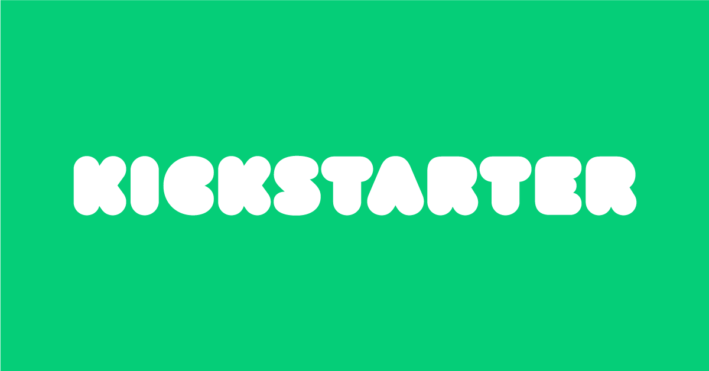

# Kickstarter Data Analysis Using Excel from Microsoft Office 365

## *Data Source*: Kaggle.com

## Background Information

Over $2 billion has been raised using the massively successful crowdfunding service, Kickstarter, but not every project has found success. Of the more than 300,000 projects launched on Kickstarter, only a third have made it through the funding process with a positive outcome.

## Project Goal:
Getting funded on Kickstarter requires meeting or exceeding the project's initial goal, so many organizations spend months looking through past projects in an attempt to discover some trick for finding success. My goal is to organize and analyze a database of 4,000 past projects in order to uncover any hidden trends that will help will successfully executing a Kickstarter campaign.

## Actions Performed On The Excel Workbook:
- Identified which campaigns were: successful, failed, canceled, or currently live

- Calculated the `Percent Funded`  to discover how many campaigns reached its initial funding goals
  
- Use 'conditional formatting' to fill each cell in the `Percent Funded` column using a three-color scale. The scale starts at 0 and is a dark shade of red, transitioning to green at 100, and blue at 200.
  
- Calculated the `Average Donation` to view how much each backer for the project paid on average
  
- Created two new columns, one called `Category` at Q and another called `Sub-Category` at R, which use formulas to split the `Category and Sub-Category` column into two parts.
  
- Made a new pivot table on a new sheet that analyzes the initial worksheet to count how many campaigns were successful, failed, canceled, or are currently live per **category** and **sub-category**.
  
- Created a stacked column pivot chart that can be filtered by `country` and `parent-category` based on the table created.

- Created new columns named `Date Created Conversion` and `Date Ended Conversion`that uses the formula from (http://spreadsheetpage.com/index.php/tip/converting_unix_timestamps/) to convert the data contained within `launched_at` and `deadline` into Excel's Date format

- Created a new sheet with a pivot table with a column of `state`, rows of `Date Created Conversion`, values based on the count of `state`, and filters based on `parent category` and `Years`. Also made pivot chart line graph that visualizes this new table.

- Made a Summary tab view of Kickstarter Project Goals into buckets of 5k difference 

## Output

## Analysis & Findings:
Given the Kickstarter campaigns data, I found the following:
- The Kickstarter data suggests that Theater campaigns have the most success (839) compared to all other parent categories. However, Music campaigns have the highest success rate percentage wise (77% vs 60% - Theater).
- Regarding sub-categories, the data suggests that Plays have the most successful outcomes (694) compared to all other sub-categories. The data also suggests the following sub categories are unsuccessful, have high risk of failures and cancelations: animation, faith, fiction, food trucks, gadgets, jazz, mobile games, nature, people, restaurants, translations, video games, wearables, and web.
- Lastly, the data suggests that campaigns are more successful during the first half of the year, especially during spring, compared to the second half of the year. At the end of the year, you can see the success and failure lines converge.
- Some of the LIMITATIONS of this dataset is it only provides historical data on the amount funded, goals, and number of backers per campaign. If the goal is to discover key trends that may lead to more successful campaigns, I believe we would need to further understand how each campaign does their messaging and advertising, and how impactful each event is for crowdsourcing. Once we understand which events and the quality of execution is most successful, we can pull marketing / social media advertising (shares on social media, “likes”, Youtube video views) data over the life of the campaign to further understand what effectively drives higher fundraising, as success is defined by meeting or exceeding the crowdsourcing goal.

## Next Steps:
- Possible other analysis we could do is doing an analysis by country, instead of category, over months of the year to see if which countries are most impacted by seasonality during the year, if given the data.
- Also, if we had more data, we can create heatmap based where the most money is fundraised by location (not country) to better understand where most of the fundraising is coming from.